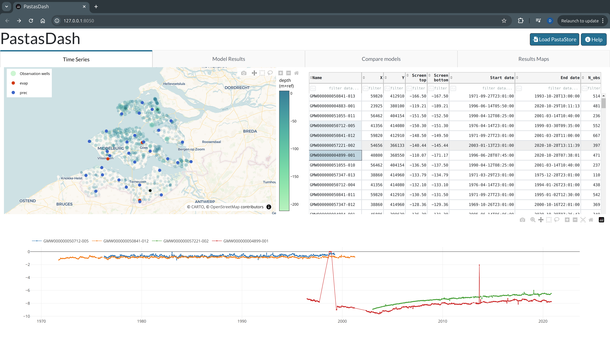
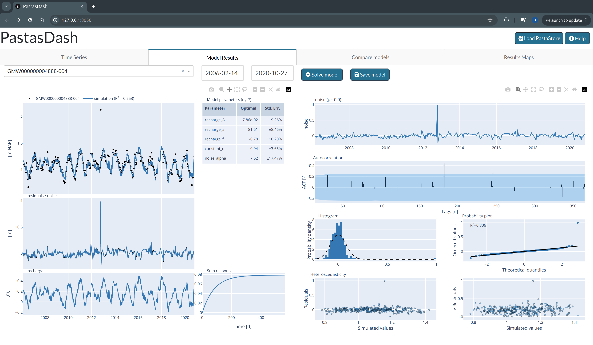
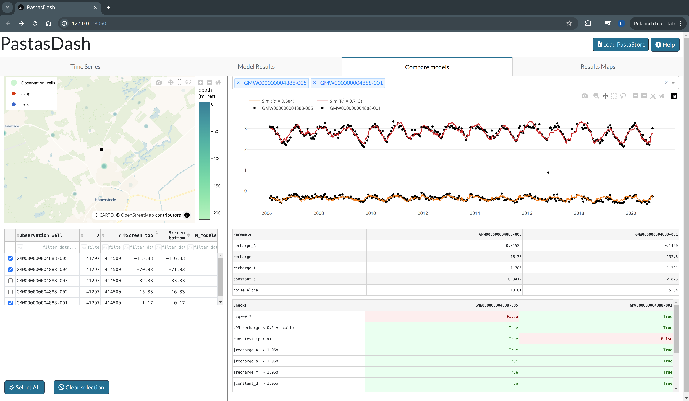
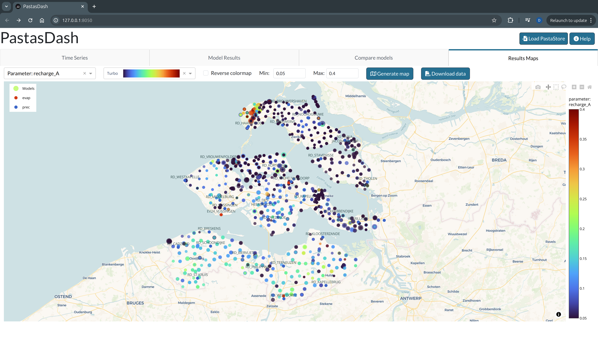

# PastasDash

Dashboard for interactively viewing time series and [Pastas](https://pastas.dev) model results.

## Installation

It is currently recommended to install PastasDash in development mode.

Using `uv`:

1. Clone the repository.
2. Navigate to the repository and create a virtual environment using `uv venv --python 3.12`.
3. From the repository root run `uv run pastasdash`.
5. Open the link (usually <http://127.0.0.1:8050/>) printed to the console by ctrl+clicking it or copying and pasting it in your browser.

Using `conda`:

1. Clone the repository.
2. Create a new environment, e.g. `conda create -n pastasdash python=3.12` and activate the environment.
3. Install `pastasdash` in development mode: `pip install -e .`
4. Start pastasdash by typing `pastasdash` in the console.
5. Open the link (usually <http://127.0.0.1:8050/>) printed to the console by ctrl+clicking it or copying and pasting it in your browser.

## Usage

**Note:** Your time series and time series models have to be stored in a [Pastastore](https://pastastore.readthedocs.io/en/latest/) to be able to use this dashboard.

1. Start the tool by typing `pastasdash` or `uv run pastasdash` in the console.
2. Open the link (usually <http://127.0.0.1:8050/>) printed to the console by ctrl+clicking it or copying and pasting it in your browser.
3. Load an existing pastastore by using the `Load Pastastore` button at the top-right of the dashboard.
4. Press the `Help` button for more information about dashboard features.

## Screenshots

### Time series tab

### Model results tab

### Compare models tab

### Results maps tab

## Authors

_Developed by D.A. Brakenhoff, Artesia, 2025_
